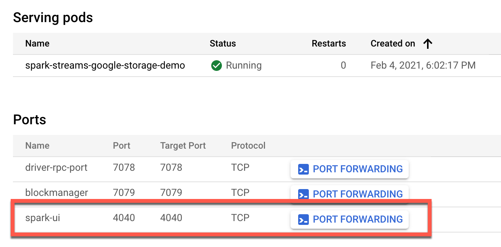

---
hide:
  - navigation
---

# Demo: Using Cloud Storage for Checkpoint Location in Spark Structured Streaming on Google Kubernetes Engine

This demo is a follow-up to [Demo: Running Spark Structured Streaming on minikube](running-spark-structured-streaming-on-minikube.md) and is going to show the steps to use ~~a persistent disk~~ [Google Cloud Storage](https://cloud.google.com/storage) for a checkpoint location in a Spark Structured Streaming application on Google Kubernetes Engine.

The demo uses the [Cloud Storage connector](https://cloud.google.com/dataproc/docs/concepts/connectors/cloud-storage) that lets Spark applications access data in Cloud Storage using the `gs://` prefix.

```text
.option("checkpointLocation", "gs://spark-checkpoint-location/")
```

The most challenging task in the demo has been to include necessary dependencies in a Docker image to support the `gs://` prefix.

!!! danger "Work in Progress"
    The demo is a work in progress.

## Before you begin

It is assumed that you have finished the following:

1. [Demo: Running Spark Structured Streaming on minikube](running-spark-structured-streaming-on-minikube.md)
1. [Demo: Running Spark Examples on Google Kubernetes Engine](running-spark-examples-on-google-kubernetes-engine.md)

## Environment Variables

You will need the following environment variables to run the demo. They are all in one section to find them easier when needed (e.g. switching terminals).

```text
export PROJECT_ID=$(gcloud info --format='value(config.project)')
export GCP_CR=eu.gcr.io/${PROJECT_ID}

export CLUSTER_NAME=spark-examples-cluster

export BUCKET_NAME=gs://spark-on-kubernetes-2021

export K8S_SERVER=$(kubectl config view --output=jsonpath='{.clusters[].cluster.server}')
export POD_NAME=spark-streams-google-storage-demo
export SPARK_IMAGE=$GCP_CR/spark-streams-google-storage-demo:0.1.0

export K8S_NAMESPACE=spark-demo
export SUBMISSION_ID=$K8S_NAMESPACE:$POD_NAME
```

## Build Spark Application Image

List images and make sure that the Spark image is available. If not, follow the steps in [Demo: Running Spark Examples on Google Kubernetes Engine](running-spark-examples-on-google-kubernetes-engine.md#prepare-spark-base-image).

```text
gcloud container images list --repository $GCP_CR
```

```text
gcloud container images list-tags $GCP_CR/spark
```

Go to your Spark application project and build the image.

```text
sbt spark-streams-google-storage-demo/docker:publishLocal
```

Push the Spark application image to the [Container Registry](https://cloud.google.com/container-registry/docs) on Google Cloud Platform.

Use [docker tag](https://docs.docker.com/engine/reference/commandline/tag/) followed by [docker image push](https://docs.docker.com/engine/reference/commandline/image_push/). Unless you've done it already at build time.

```text
docker tag spark-streams-google-storage-demo:0.1.0 $GCP_CR/spark-streams-google-storage-demo:0.1.0
```

```text
docker push $GCP_CR/spark-streams-google-storage-demo:0.1.0
```

List the available images.

```text
gcloud container images list --repository $GCP_CR
```

```text
NAME
eu.gcr.io/spark-on-kubernetes-2021/spark
eu.gcr.io/spark-on-kubernetes-2021/spark-streams-demo
eu.gcr.io/spark-on-kubernetes-2021/spark-streams-google-storage-demo
```

## Create Kubernetes Cluster

Create a Kubernetes cluster as described in [Demo: Running Spark Examples on Google Kubernetes Engine](running-spark-examples-on-google-kubernetes-engine.md#create-kubernetes-cluster).

```text
gcloud container clusters create $CLUSTER_NAME \
  --cluster-version=latest
```

Wait a few minutes before the GKE cluster is ready.

In the end, you should see the messages as follows:

```text
Creating cluster spark-examples-cluster in europe-west3-b... Cluster is being health-checked (master is healthy)...done.
Created [https://container.googleapis.com/v1/projects/...
To inspect the contents of your cluster, go to: https://console.cloud.google.com/kubernetes/workload_/gcloud/...
kubeconfig entry generated for spark-examples-cluster.
NAME                    LOCATION        MASTER_VERSION    MASTER_IP     MACHINE_TYPE  NODE_VERSION      NUM_NODES  STATUS
spark-examples-cluster  europe-west3-b  1.18.14-gke.1600  34.107.83.39  e2-medium     1.18.14-gke.1600  3          RUNNING
```

## Create Cloud Storage Bucket

Quoting [Connecting to Cloud Storage buckets](https://cloud.google.com/compute/docs/disks/gcs-buckets):

> [Cloud Storage](https://cloud.google.com/storage) is a flexible, scalable, and durable storage option for your virtual machine instances. You can read and write files to Cloud Storage buckets from almost anywhere, so you can use buckets as common storage between your instances, App Engine, your on-premises systems, and other cloud services.

!!! tip
    You may want to review [Storage options](https://cloud.google.com/compute/docs/disks) for alternative instance storage options.

```text
gsutil mb -b on $BUCKET_NAME
```

```text
Creating gs://spark-on-kubernetes-2021/...
```

### List Contents of Bucket

```text
gsutil ls -l $BUCKET_NAME
```

## Run Spark Structured Streaming on GKE

### Create Kubernetes Resources

Create Kubernetes resources as described in [Demo: Running Spark Examples on Google Kubernetes Engine](running-spark-examples-on-google-kubernetes-engine.md#create-kubernetes-resources).

```text
k create -f k8s/rbac.yml
```

```text
namespace/spark-demo created
serviceaccount/spark created
clusterrolebinding.rbac.authorization.k8s.io/spark-role created
```

### Create Service Account with Browser Role

Loading data from a bucket in a Spark application requires a service account with Browser role.

```text
FIXME
```

In order to use the service account and access the bucket using `gs://` URI scheme you are going to use the following additional configuration properties:

```text
--conf spark.hadoop.fs.gs.impl=com.google.cloud.hadoop.fs.gcs.GoogleHadoopFileSystem
--conf spark.hadoop.google.cloud.auth.service.account.enable=true
```

### Submit Spark Application

Submit the Spark Structured Streaming application to GKE as described in [Demo: Running Spark Structured Streaming on minikube](running-spark-structured-streaming-on-minikube.md#submit-spark-application-to-minikube).

You may optionally delete all pods (since we use a fixed name for the demo).

```text
k delete po --all -n $K8S_NAMESPACE
```

```text
./bin/spark-submit \
  --master k8s://$K8S_SERVER \
  --deploy-mode cluster \
  --name $POD_NAME \
  --class meetup.SparkStreamsApp \
  --conf spark.kubernetes.driver.request.cores=400m \
  --conf spark.kubernetes.executor.request.cores=100m \
  --conf spark.kubernetes.container.image=$SPARK_IMAGE \
  --conf spark.kubernetes.driver.pod.name=$POD_NAME \
  --conf spark.kubernetes.namespace=$K8S_NAMESPACE \
  --conf spark.kubernetes.authenticate.driver.serviceAccountName=spark \
  --conf spark.kubernetes.submission.waitAppCompletion=false \
  --conf spark.hadoop.fs.gs.impl=com.google.cloud.hadoop.fs.gcs.GoogleHadoopFileSystem \
  --conf spark.hadoop.google.cloud.auth.service.account.enable=true \
  --verbose \
  local:///opt/spark/jars/meetup.spark-streams-demo-0.1.0.jar $BUCKET_NAME
```

### Monitoring

Watch the logs of the driver and executor pods.

```text
k logs -f $POD_NAME -n $K8S_NAMESPACE
```

Observe pods in another terminal.

```text
k get po -w -n $K8S_NAMESPACE
```

## FIXME NullPointerException: projectId must not be null

```text
Exception in thread "main" java.lang.NullPointerException: projectId must not be null
	at com.google.cloud.hadoop.repackaged.gcs.com.google.common.base.Preconditions.checkNotNull(Preconditions.java:897)
	at com.google.cloud.hadoop.repackaged.gcs.com.google.cloud.hadoop.gcsio.GoogleCloudStorageImpl.createBucket(GoogleCloudStorageImpl.java:437)
	at com.google.cloud.hadoop.repackaged.gcs.com.google.cloud.hadoop.gcsio.GoogleCloudStorage.createBucket(GoogleCloudStorage.java:88)
	at com.google.cloud.hadoop.repackaged.gcs.com.google.cloud.hadoop.gcsio.GoogleCloudStorageFileSystem.mkdirsInternal(GoogleCloudStorageFileSystem.java:456)
	at com.google.cloud.hadoop.repackaged.gcs.com.google.cloud.hadoop.gcsio.GoogleCloudStorageFileSystem.mkdirs(GoogleCloudStorageFileSystem.java:444)
	at com.google.cloud.hadoop.fs.gcs.GoogleHadoopFileSystemBase.mkdirs(GoogleHadoopFileSystemBase.java:911)
	at org.apache.hadoop.fs.FileSystem.mkdirs(FileSystem.java:2275)
	at org.apache.spark.sql.execution.streaming.StreamExecution.<init>(StreamExecution.scala:137)
	at org.apache.spark.sql.execution.streaming.MicroBatchExecution.<init>(MicroBatchExecution.scala:50)
	at org.apache.spark.sql.streaming.StreamingQueryManager.createQuery(StreamingQueryManager.scala:317)
	at org.apache.spark.sql.streaming.StreamingQueryManager.startQuery(StreamingQueryManager.scala:359)
	at org.apache.spark.sql.streaming.DataStreamWriter.startQuery(DataStreamWriter.scala:466)
	at org.apache.spark.sql.streaming.DataStreamWriter.startInternal(DataStreamWriter.scala:456)
	at org.apache.spark.sql.streaming.DataStreamWriter.start(DataStreamWriter.scala:301)
	at meetup.SparkStreamsApp$.delayedEndpoint$meetup$SparkStreamsApp$1(SparkStreamsApp.scala:25)
	at meetup.SparkStreamsApp$delayedInit$body.apply(SparkStreamsApp.scala:7)
```

## Google Cloud Console

Review the Spark application in the [Google Cloud Console](https://console.cloud.google.com/) of the project:

1. [Workloads](https://console.cloud.google.com/kubernetes/workload)
1. [Services & Ingress](https://console.cloud.google.com/kubernetes/discovery)
1. [Configuration](https://console.cloud.google.com/kubernetes/config) (make sure to use `spark-demo` namespace)

### Services & Ingress

While in **Services & Ingress**, click the service to enable Spark UI.

1. Go to **Service details** and scroll down to the **Ports** section.

2. Click **PORT FORWARDING** button next to **spark-ui** entry.



## Kill Spark Application

In the end, you can `spark-submit --kill` the Spark Structured Streaming application.

```text
./bin/spark-submit \
  --master k8s://$K8S_SERVER \
  --kill $SUBMISSION_ID
```

## Clean Up

Delete the bucket.

```text
gsutil rm -r $BUCKET_NAME
```

Delete cluster resources as described in [Demo: Running Spark Examples on Google Kubernetes Engine](running-spark-examples-on-google-kubernetes-engine.md#clean-up).

_That's it. Congratulations!_

## References

* [How to use Google Cloud Storage for checkpoint location in streaming query?](https://stackoverflow.com/q/56152492/1305344)
* [Quickstart: Using the gsutil tool](https://cloud.google.com/storage/docs/quickstart-gsutil)